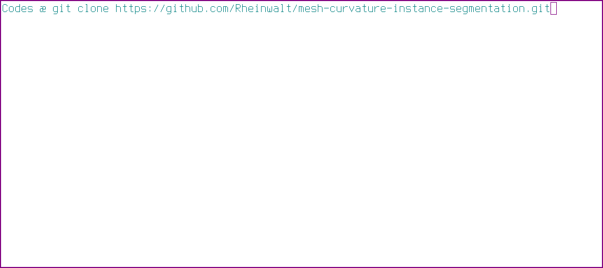

# Curvature-based pebble segmentation for reconstructed surface meshes

See the [tutorial](tutorial.ipynb) for an example of how to use this software.

## Publication

Rheinwalt, Aljoscha, Benjamin Purinton, and Bodo Bookhagen. [*Curvature-based pebble segmentation for reconstructed surface meshes.*](https://doi.org/10.5194/esurf-13-923-2025 "https://doi.org/10.5194/esurf-13-923-2025") Earth Surface Dynamics 13.5 (2025): 923-940.
